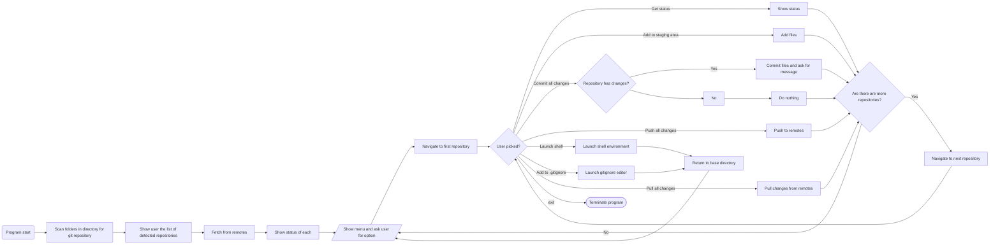

# git-repository-manager

### The problem

I have a wide multitude of git repositories that I utilize daily. It is often tedious to manually manage all of them. Any missed step results in merge conflicts that need to be solved, which oftentimes takes some digging.

---

### The solution

This program is designed to simplify the process of managing these repositories. 

It will fetch from the remote and display any repositories that have modified contents, and then provide the user various options on how they would like to manage the repositories.

These options will include:
- Macros to automatically add, commit, and push files
- Specify a commit message per repository (with optional timestamp attachment)
- Load a shell environment for the user to directly execute commands with
- Add files to be ignored (modifying .gitignore easily)

This will prevent the user from forgetting about any changes they have made in the repositories and thus avoid merge conflicts

In the event there is a merge conflict, the program will notify the user of the merge conflict and quit. This is to allow the user to manually deal with it, as it is very hazardous to automate the process.

The program will have basic functions such as ensuring that the correct input is given and protecting against invalid options

---

### Flowchart

---
### Usage

Basic workflow:

1. Clone target repository (git clone <url>)
2. Launch program in the folder that contains the repositories you want to manage
3. Pull in any changes from remote
4. Add any files you want to explicitly ignore to .gitignore
5. Add any untracked files
6. Commit all changes
7. Push to remotes
8. Repeat!

All of the options directly call on git, and do not add any special parameters

Additionally, one should automate managing multiple repositories unless they understand how git itself works

**Please refer to git's documentation for proper usage beyond what has been listed (including info on how to solve merge conflicts!)**

https://git-scm.com/docs

---

### Further notes

I plan on eventually porting this program to the [Rust](https://www.rust-lang.org/) language when I get the time
