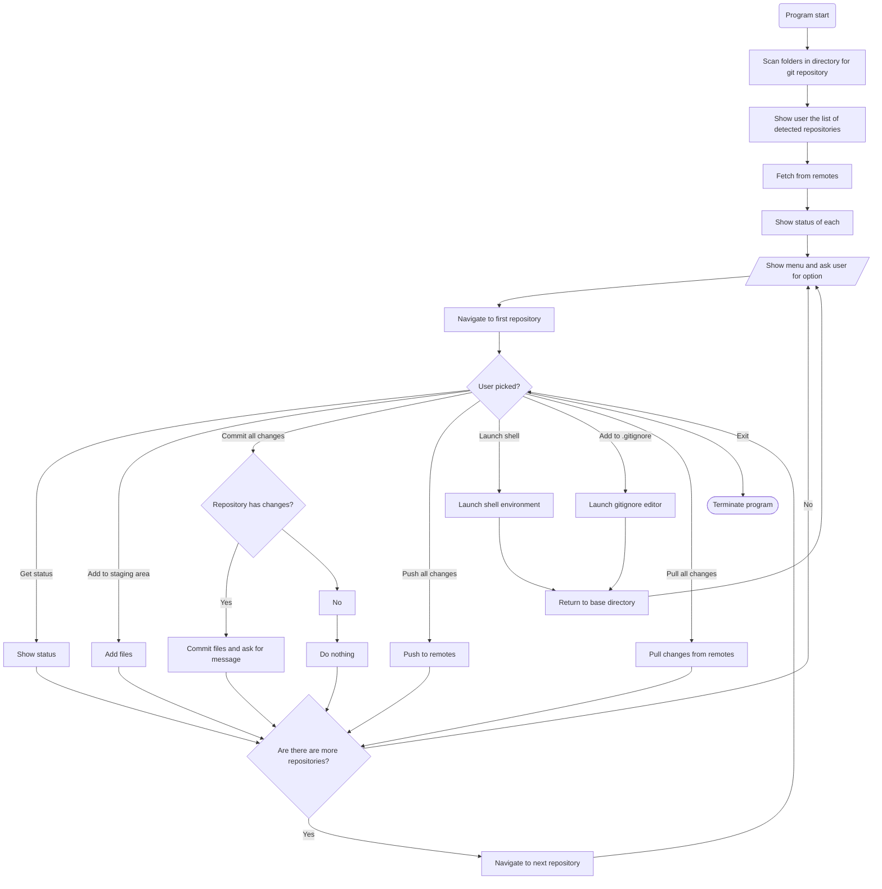

# git-repository-manager


### The problem

I have a wide multitude of git repositories that I utilize daily. It is often tedious to manually manage all of them. Any missed step results in merge conflicts that need to be solved, which oftentimes takes some digging.

---

### The solution

This program is designed to simplify the process of managing these repositories. 

It will fetch from the remote and display any repositories that have modified contents, and then provide the user various options on how they would like to manage the repositories.

These options will include:
- Macros to automatically add, commit, and push files
- Specify a commit message per repository (with optional timestamp attachment)
- Load a shell environment for the user to directly execute commands with
- Add files to be ignored (modifying .gitignore easily)

This will prevent the user from forgetting about any changes they have made in the repositories and thus avoid merge conflicts

In the event there is a merge conflict, the program will notify the user of the merge conflict and quit. This is to allow the user to manually deal with it, as it is very hazardous to automate the process.

The program will have basic functions such as ensuring that the correct input is given and protecting against invalid options

---

### Flowchart

---

### Sample Run
```

user@zsh ~> grepomanager

Git repository manager v0.1.0

Scanning for repositories in <directory>...
Found 3 git repositories!
<repo1>
<repo2>
<repo3>

Fetching from remote...

Status of <repo1>:
Untracked files:
foo.txt
bar.html
baz.md

Status of <repo2>
2 Commits ahead, 0 commits behind

Status of <repo3>
Unsaved changes in:
foo.html
bar.cpp

What would you like to do?
A) Add all files
B) Commit all files to staging
C) Push all staged commits
D) Launch shell
E) Add files to ignore
F) Pull changes from remote
G) Exit (or Ctrl-C at any time!)

Enter option: A

Added: 
<repo1>:
foo.txt
bar.html
baz.md

Done!

What would you like to do?
A) Add all files
B) Commit all files to staging
C) Push all staged commits
D) Launch shell
E) Add files to ignore
F) Pull changes from remote
G) Exit (or Ctrl-C at any time!)

Enter option: B

Committed:

<repo1>:
foo.txt
bar.html
baz.md

<repo2>:
foo.html
bar.cpp

Done!

What would you like to do?
A) Add all files
B) Commit all files to staging
C) Push all staged commits
D) Launch shell
E) Add files to ignore
F) Pull changes from remote
G) Exit (or Ctrl-C at any time!)

Enter option: C

Pushed 1 commit to <repo1's remote URL>
Pushed 2 commits to <repo2's remote url>
Pushed 1 commit to <repo3's remote URL>

Done!

What would you like to do?
A) Add all files
B) Commit all files to staging
C) Push all staged commits
D) Launch shell
E) Add files to ignore
F) Pull changes from remote
G) Exit (or Ctrl-C at any time!)

Enter option: G

Exiting...

user@zsh ~> 
```
---

### Further notes

I plan on eventually porting this program to the [Rust](https://www.rust-lang.org/) language when I get the time
